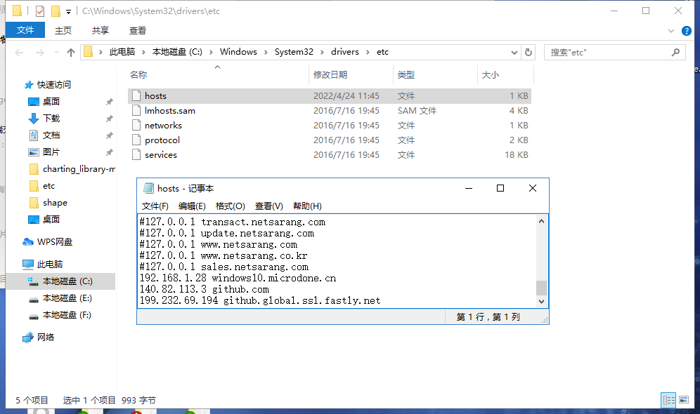

# Fix Bug

## Failed to connect to github.com port 443: Timed out 及 ping github.com请求超时

- **配置git proxy**
- **修改hosts**
    1. <https://www.ipaddress.com>查询github的IP和查询github.global.ssl.fastly.net的IP
    2. 将查询到的ip添加到hosts中，如下图: