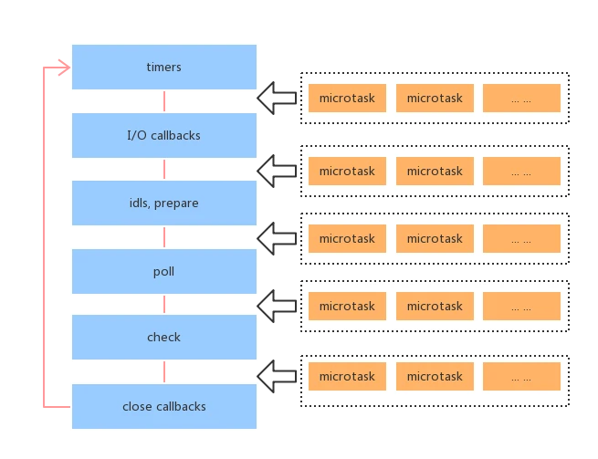
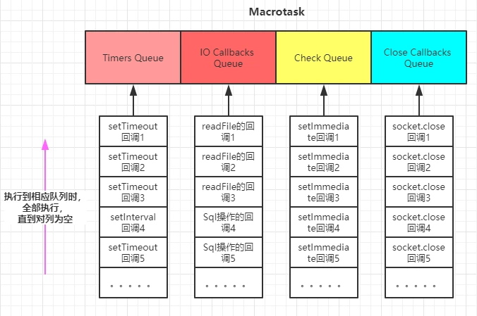

# Event Loop

Event loop 是一个执行模型，在不同的地方有不同的实现。浏览器和 NodeJS 基于不同的技术实现了各自的 Event Loop。

## 宏队列和微队列

**宏队列，macrotask，也叫 tasks**。一些异步任务的回调会依次进入 macro task queue，等待后续被调用，这些异步任务包括：

- setTimeout
- setInterval
- setImmediate (Node 独有)
- requestAnimationFrame (浏览器独有)
- I/O
- UI rendering (浏览器独有)

**微队列，microtask，也叫 jobs**。另一些异步任务的回调会依次进入 micro task queue，等待后续被调用，这些异步任务包括：

- process.nextTick (Node 独有)
- Promise
- Object.observe
- MutationObserver

## 浏览器的 Event Loop

执行一个 JavaScript 代码的具体流程：

1. 执行全局 Script 同步代码，这些同步代码有一些是同步语句，有一些是异步语句（比如 setTimeout 等）；
2. 全局 Script 代码执行完毕后，调用栈 Stack 会清空；
3. 从微队列 microtask queue 中取出位于队首的回调任务，放入调用栈 Stack 中执行，执行完后 microtask queue 长度减 1；
4. 继续取出位于队首的任务，放入调用栈 Stack 中执行，以此类推，直到直到把 microtask queue 中的所有任务都执行完毕。注意，如果在执行 microtask 的过程中，又产生了 microtask，那么会加入到队列的末尾，也会在这个周期被调用执行；
5. microtask queue 中的所有任务都执行完毕，此时 microtask queue 为空队列，调用栈 Stack 也为空；
6. 取出宏队列 macrotask queue 中位于队首的任务，放入 Stack 中执行；
7. 执行完毕后，调用栈 Stack 为空；
8. 重复第 3-7 个步骤；
9. 重复第 3-7 个步骤；
10. ......

这里归纳 3 个重点：

1. 宏队列 macrotask 一次只从队列中取一个任务执行，执行完后就去执行微任务队列中的任务；
2. 微任务队列中所有的任务都会被依次取出来执行，知道 microtask queue 为空；
3. 图中没有画 UI rendering 的节点，因为这个是由浏览器自行判断决定的，但是只要执行 UI rendering，它的节点是在执行完所有的 microtask 之后，下一个 macrotask 之前，紧跟着执行 UI render。

```js
console.log(1);

setTimeout(() => {
  console.log(2);
  Promise.resolve().then(() => {
    console.log(3);
  });
});

new Promise((resolve, reject) => {
  console.log(4);
  resolve(5);
}).then((data) => {
  console.log(data);
});

setTimeout(() => {
  console.log(6);
});

console.log(7);

// 正确答案
1;
4;
7;
5;
2;
3;
6;
```

```js
console.log(1);

setTimeout(() => {
  console.log(2);
  Promise.resolve().then(() => {
    console.log(3);
  });
});

new Promise((resolve, reject) => {
  console.log(4);
  resolve(5);
}).then((data) => {
  console.log(data);

  Promise.resolve()
    .then(() => {
      console.log(6);
    })
    .then(() => {
      console.log(7);

      setTimeout(() => {
        console.log(8);
      }, 0);
    });
});

setTimeout(() => {
  console.log(9);
});

console.log(10);

// 正确答案
1;
4;
10;
5;
6;
7;
2;
3;
9;
8;
```

**在执行微队列 microtask queue 中任务的时候，如果又产生了 microtask，那么会继续添加到队列的末尾，也会在这个周期执行，直到 microtask queue 为空停止。**

## NodeJS 中的 Event Loop

NodeJS 的 Event Loop 中，执行宏队列的回调任务有 6 个阶段，如下图:


各个阶段执行的任务如下：

- timers 阶段：这个阶段执行 setTimeout 和 setInterval 预定的 callback
- I/O callback 阶段：执行除了 close 事件的 callbacks、被 timers 设定的 callbacks、setImmediate()设定的 callbacks 这些之外的 callbacks
- idle, prepare 阶段：仅 node 内部使用
- poll 阶段：获取新的 I/O 事件，适当的条件下 node 将阻塞在这里
- check 阶段：执行 setImmediate()设定的 callbacks
- close callbacks 阶段：执行 socket.on('close', ....)这些 callbacks

**NodeJS 中宏队列主要有 4 个**

1. Timers Queue
2. IO Callbacks Queue
3. Check Queue
4. Close Callbacks Queue

这 4 个都属于宏队列，但是在浏览器中，可以认为只有一个宏队列，所有的 macrotask 都会被加到这一个宏队列中，但是在 NodeJS 中，不同的 macrotask 会被放置在不同的宏队列中。

**NodeJS 中微队列主要有 2 个：**

1. Next Tick Queue：是放置 process.nextTick(callback)的回调任务的
2. Other Micro Queue：放置其他 microtask，比如 Promise 等

在浏览器中，也可以认为只有一个微队列，所有的 microtask 都会被加到这一个微队列中，但是在 NodeJS 中，不同的 microtask 会被放置在不同的微队列中。

大体解释一下 NodeJS 的 Event Loop 过程：

1. 执行全局 Script 的同步代码
2. 执行 microtask 微任务，先执行所有 Next Tick Queue 中的所有任务，再执行 Other Microtask Queue 中的所有任务
3. 开始执行 macrotask 宏任务，共 6 个阶段，从第 1 个阶段开始执行相应每一个阶段 macrotask 中的所有任务，注意，这里是所有每个阶段宏任务队列的所有任务，在浏览器的 Event Loop 中是只取宏队列的第一个任务出来执行，每一个阶段的 macrotask 任务执行完毕后，开始执行微任务，也就是步骤 2
4. Timers Queue -> 步骤 2 -> I/O Queue -> 步骤 2 -> Check Queue -> 步骤 2 -> Close Callback Queue -> 步骤 2 -> Timers Queue ......
5. 这就是 Node 的 Event Loop

**关于 NodeJS 的 macrotask queue 和 microtask queue，我画了两张图，大家作为参考：**


```js
console.log("start");

setTimeout(() => {
  // callback1
  console.log(111);
  setTimeout(() => {
    // callback2
    console.log(222);
  }, 0);
  setImmediate(() => {
    // callback3
    console.log(333);
  });
  process.nextTick(() => {
    // callback4
    console.log(444);
  });
}, 0);

setImmediate(() => {
  // callback5
  console.log(555);
  process.nextTick(() => {
    // callback6
    console.log(666);
  });
});

setTimeout(() => {
  // callback7
  console.log(777);
  process.nextTick(() => {
    // callback8
    console.log(888);
  });
}, 0);

process.nextTick(() => {
  // callback9
  console.log(999);
});

console.log("end");

// 正确答案
start;
end;
999;
111;
777;
444;
888;
555;
333;
666;
222;
```

下面引入 Promise 再来看一个例子：

```js
console.log("1");

setTimeout(function () {
  console.log("2");
  process.nextTick(function () {
    console.log("3");
  });
  new Promise(function (resolve) {
    console.log("4");
    resolve();
  }).then(function () {
    console.log("5");
  });
});

new Promise(function (resolve) {
  console.log("7");
  resolve();
}).then(function () {
  console.log("8");
});
process.nextTick(function () {
  console.log("6");
});

setTimeout(function () {
  console.log("9");
  process.nextTick(function () {
    console.log("10");
  });
  new Promise(function (resolve) {
    console.log("11");
    resolve();
  }).then(function () {
    console.log("12");
  });
});

// 正确答案
1;
7;
6;
8;
2;
4;
9;
11;
3;
10;
5;
12;
```

## 总结

1. 浏览器的 Event Loop 和 NodeJS 的 Event Loop 是不同的，实现机制也不一样，不要混为一谈。
2. 浏览器可以理解成只有 1 个宏任务队列和 1 个微任务队列，先执行全局 Script 代码，执行完同步代码调用栈清空后，从微任务队列中依次取出所有的任务放入调用栈执行，微任务队列清空后，从宏任务队列中只取位于队首的任务放入调用栈执行，注意这里和 Node 的区别，只取一个，然后继续执行微队列中的所有任务，再去宏队列取一个，以此构成事件循环。
3. NodeJS 可以理解成有 4 个宏任务队列和 2 个微任务队列，但是执行宏任务时有 6 个阶段。先执行全局 Script 代码，执行完同步代码调用栈清空后，先从微任务队列 Next Tick Queue 中依次取出所有的任务放入调用栈中执行，再从微任务队列 Other Microtask Queue 中依次取出所有的任务放入调用栈中执行。
4. MacroTask 包括： setTimeout、setInterval、 setImmediate(Node)、requestAnimation(浏览器)、IO、UI rendering
5. Microtask 包括： process.nextTick(Node)、Promise、Object.observe、MutationObserver

> leocoder[Event Loop](https://segmentfault.com/a/1190000016278115)
