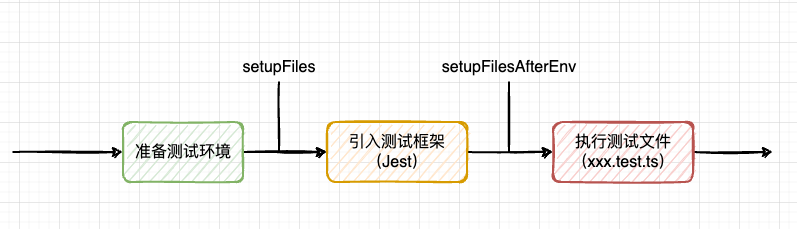

# [Jest](https://github.yanhaixiang.com/jest-tutorial/)

## `setupFilesAfterEnv` vs `setupFiles`
插入一下：相信很多人都知道 Jest 的 `setupFiles`，但不太了解 `setupFilesAfterEnv`，这里简单讲讲它们的区别 **（可从 [官网的介绍](https://jestjs.io/docs/configuration#setupfiles-array)了解更多）：**

简单来说：

- `setupFiles` 是在 **引入测试环境（比如下面的 `jsdom`）之后** 执行的代码
- `setupFilesAfterEnv` 则是在 **安装测试框架之后** 执行的代码
具体应用场景是：在 `setupFiles` 可以添加 **测试环境** 的补充，比如 Mock 全局变量 `abcd` 等。而在 `setupFilesAfterEnv` 可以引入和配置 Jest/Jasmine（Jest 内部使用了 Jasmine） 插件。

如果你试图在 `setupFiles` 添加 Jest 的扩展/插件，那么你可能会得到 `expect is not defined` 报错。[详见这个 Issue](https://github.com/testing-library/jest-dom/issues/122#issuecomment-650520461)。